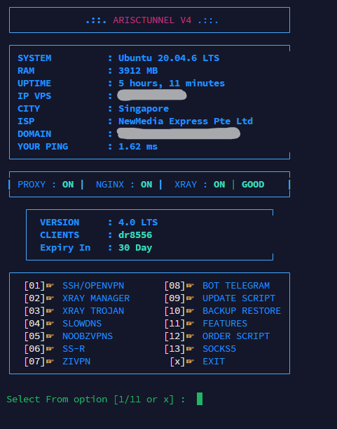

# ARISCTUNNEL V4

**Final Script Tunneling by ARI STORE**

<p align="center">
  
</p>

## Description

ARISCTUNNEL V4 is a comprehensive tunneling script designed for setting up and managing VPN services, SSL certificates, UDP configurations, and backups. This script provides tools for various tunneling protocols including OpenVPN, Xray, Shadowsocks, Trojan, VLESS, VMess, and more.

## Features

- **SSL Certificate Fix**: Universal SSL certificate management and fixes.
- **UDP Configuration**: Tools for UDP tunneling and optimization.
- **Backup and Restore**: Universal backup and restore functionality for configurations.
- **VPN Services**: Support for multiple VPN protocols:
  - OpenVPN
  - Xray (VLESS, VMess)
  - Shadowsocks
  - Trojan
  - SOCKS5
  - ZIVPN UDP
  - WebSocket (WS)
  - DNS over HTTPS (DoH)
  - SlowDNS
- **Bot Integration**: Automated bot scripts for management.
- **Configuration Management**: Easy setup for services like HAProxy, Nginx, Dropbear, and more.
- **Monitoring and Limits**: Built-in tools for speed testing, quota management, and IP limiting.
- **Webmin Menu**: Administrative interface for server management.

## Installation

### Costum Os UBUNTU 20.04
```bash
apt update -y && wget https://raw.githubusercontent.com/bin456789/reinstall/main/reinstall.sh -O reinstall && chmod +x reinstall && bash reinstall ubuntu 20.04 && reboot
```

### Install Script
```bash
apt update -y && apt install screen curl wget python3-pip -y && wget -q https://raw.githubusercontent.com/arivpnstores/v4/main/Vpn/xray.zip -O /tmp/install && chmod +x /tmp/install && screen -S ari /tmp/install
```

### Update Script
```bash
rm -rf /usr/bin/menu_version && rm -rf update.sh && wget -O update.sh https://raw.githubusercontent.com/arivpnstores/v4/main/update.sh && chmod +x update.sh && ./update.sh
```
### Fix Izin
```bash
wget https://raw.githubusercontent.com/arivpnstores/v4/main/fix-izin.sh && chmod +x fix-izin.sh && ./fix-izin.sh        
```
### Fix SSL Certificate Universal
```bash
wget -O fix-add-ssl.sh https://raw.githubusercontent.com/arivpnstores/v4/main/fix-add-ssl.sh && chmod +x fix-add-ssl.sh && ./fix-add-ssl.sh
```

### Fix UDP
```bash
wget -O udp.sh https://raw.githubusercontent.com/arivpnstores/v4/main/udp.sh && chmod +x udp.sh && ./udp.sh
```

### Backup Universal
```bash
wget -O restore-universal.sh https://raw.githubusercontent.com/arivpnstores/v4/main/Cdy/restore-universal.sh && chmod +x restore-universal.sh && ./restore-universal.sh
```

## Supported Services

- OpenVPN
- Xray (VLESS, VMess, Trojan)
- Shadowsocks
- SOCKS5
- WebSocket
- DNS Tunneling (DNSTT)
- UDP HC
- ZIVPN UDP
- HAProxy
- Nginx
- Dropbear
- SSH
- Webmin

## Terms of Service

- **NO SPAM**
- **NO DDOS**
- **NO HACKING AND CARDING**
- **NO TORRENT**
- **NO MULTI LOGIN**

Violations may result in service termination.

## Premium Order

For premium features and support, contact:

**TELE : t.me/ARI_VPN_STORE**

## Directory Structure

- `Bot/`: Bot scripts and automation tools
- `Cdy/`: Backup and restore utilities
- `Cfg/`: Configuration files for various services
- `Fls/`: Executable files and services
- `Vpn/`: VPN-related files and archives

## Contributing

Contributions are welcome. Please ensure compliance with the terms of service.

## License

This project is proprietary. Contact the author for licensing information.

---

**ARI STORE - ARISCTUNNEL V4**


